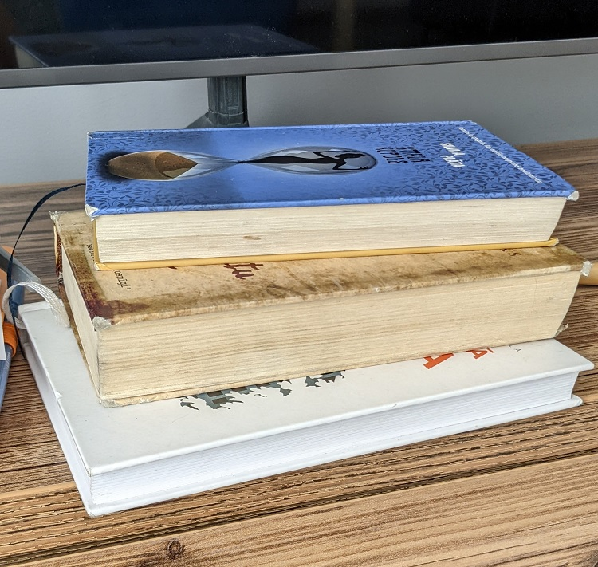

# Zane.Zvirgzdina
# Īsumā par mani
Mani sauc **Zane Zvirgzdiņa**. Oriģināli esmu no Tukuma, bet vismaz 10 gadus dzīvoju un strādāju Rīgā. 
Brīvajā laikā patīk pavadīt laiku ar ģimeni, draugiem, bet īpaši pandēmijas laikā pievērsos dažādu rokdarbu veidošanai, kā arī daudz aktīvāk lasīju grāmatas. Šos abus hobijus piekopju joprojām.
## Mīļākā grāmata
Ja man jautātu, kura ir mana mīļākā grāmata, es varētu ilgi un dikti domāt, iespējams, nemaz neatbildot uz jautājumu. 
Taču, ja man pajautātu pēdējā laikā labāko lasīto grāmatu, es minētu "Laziness does not exist", ko noteikti ieteiktu visiem darbaholiķiem. 
Vairāk izklaidei varu minēt Dave Grohl "The Storyteller", ko iesaku klausīties audio formātā. 
Tā kā, ja nepieciešamas idejas lasāmvielai - droši pie manis. Lūk, ir mans lasītāja [profils](https://www.goodreads.com/zanezvirgzdina). 
Lūk, attēls ar tuvākajā laikā lasāmajām grāmatām: 

## Testēšana un es
Kā es nonācu līdz idejai, ka vēlētos būt testētājs? 
Skatījos Riga TechGirls "Iepazīsti tehnoloģijas" un sapratu, ka vairāki celiņi mani interesē - gan UX/UI, gan testēšana. 
Tā kā ar dizainu saistības īsti nav bijušas, nolēmu, ka jāsāk izpētīt, ko dara testētāji. 
Sapratu, ka neapzināti, ikdienā jau biju darbojusies kā "testētājs", sniedzot atsauksmes par mājaslapām/lietotnēm un kolēģu darbu, ar mērķi uzlabot galarezultātu. 
RTG mentors iedrošināja iepazīties ne tikai ar manuālo testēšanu, bet arī ar automatizēto, tādēļ nolēmu izmantot "Mācības pieaugušajiem" piedāvājumu.

Kur vedīs mani šis ceļs? Laiks rādīs! Ticu un ceru, ka jaunu zināšanu un piedzīvojumu virzienā!
